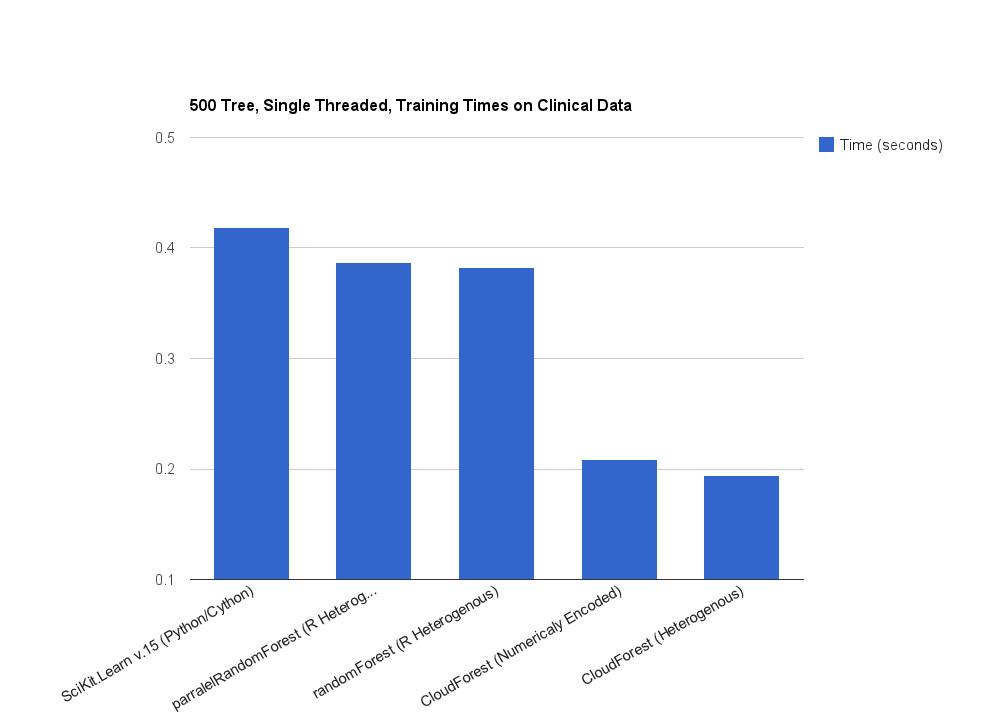
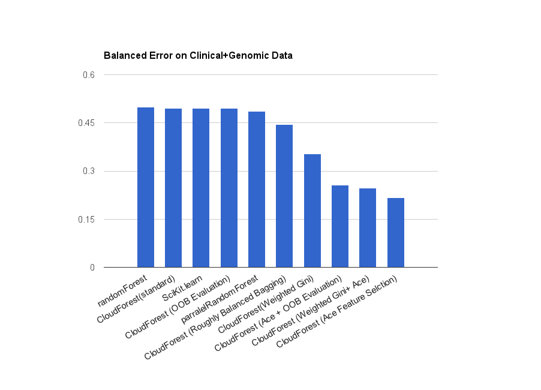

CloudForest
==============

[](https://travis-ci.org/ryanbressler/CloudForest) 
[](https://godoc.org/github.com/ryanbressler/CloudForest)

Fast, flexible, multi-threaded ensembles of decision trees for machine
learning in pure Go (golang). 

CloudForest allows for a number of related algorithms for classification, regression, feature selection 
and structure analysis on heterogeneous numerical / categorical data with missing values. These include:

* Breiman and Cutler's Random Forest for Classification and Regression
* Adaptive Boosting (AdaBoost) Classification 
* Gradient Boosting Tree Regression and Two Class Classification
* Hellinger Distance Trees for Classification
* Entropy, Cost driven and Class Weighted classification
* L1/Absolute Deviance Decision Tree regression
* Improved Feature Selection via artificial contrasts with ensembles (ACE)
* Roughly Balanced Bagging for Unbalanced Data
* Improved robustness using out of bag cases and artificial contrasts.
* Support for missing values via bias correction or three way splitting.
* Proximity/Affinity Analysis suitable for manifold learning
* A number of experimental splitting criteria

The Design Prioritizes:

* Training speed
* Performance on highly dimensional heterogeneous datasets (e.g. genetic and clinical data).
* An optimized set of core functionality. 
* The flexibility to quickly implement new impurities and algorithms using the common core.
* The ability to natively handle non numerical data types and missing values.
* Use in a multi core or multi machine environment.

It can achieve quicker training times then many other popular implementations on some datasets. 
This is the result of cpu cache friendly memory utilization well suited to modern processors and
separate, optimized paths to learn splits from binary, numerical and categorical data.



CloudForest offers good general accuracy and the alternative and augmented algorithms it implements can 
offer reduced error rate for specific use cases including especially recovering a signal from noisy, 
high dimensional data prone to over-fitting and predicting rare events and unbalanced classes
(both of which are typical in genetic studies of diseases). These methods should be included in 
parameter sweeps to maximize accuracy.

 

(Work on benchmarks and optimization is ongoing, if you find a slow use case please raise an issue.)
 
Command line utilities to grow, apply and analyze forests and do cross validation are provided or 
CloudForest can be used as a library in go programs.

This Document covers command line usage, file formats and some algorithmic background.

Documentation for coding against CloudForest has been generated with godoc and can be viewed live at:
http://godoc.org/github.com/ryanbressler/CloudForest

Pull requests, spelling corrections and bug reports are welcome; Code Repo and Issue tracker can be found at:
https://github.com/ryanbressler/CloudForest

CloudForest was created in the Shumelivich Lab at the Institute for Systems
Biology.

([Build status](https://travis-ci.org/ryanbressler/CloudForest.png?branch=master) includes accuracy tests on 
iris and Boston housing price datasets and multiple go versions.)

Installation
-------------
With [go installed](http://golang.org/doc/install):

```bash
go get github.com/ryanbressler/CloudForest
go install github.com/ryanbressler/CloudForest/growforest
go install github.com/ryanbressler/CloudForest/applyforest

#optional utilities
go install github.com/ryanbressler/CloudForest/leafcount
go install github.com/ryanbressler/CloudForest/utils/nfold
go install github.com/ryanbressler/CloudForest/utils/toafm
```

To update to the latest version use the -u flag
```bash
go get -u github.com/ryanbressler/CloudForest
go install -u github.com/ryanbressler/CloudForest/growforest
go install -u github.com/ryanbressler/CloudForest/applyforest

#optional utilities
go install -u github.com/ryanbressler/CloudForest/leafcount
go install -u github.com/ryanbressler/CloudForest/utils/nfold
go install -u github.com/ryanbressler/CloudForest/utils/toafm
```


Quick Start
-------------

Data can be provided in a tsv based anotated feature matrix or in arff or libsvm formats with
".arff" or ".libsvm" extensions. Details are discussed in the [Data File Formats](#data-file-formats) section below 
and a few example data sets are included in the "data" directory.

```bash
#grow a predictor forest with default parameters and save it to forest.sf
growforest -train train.fm -rfpred forest.sf -target B:FeatureName

#grow a 1000 tree forest using, 16 cores and report out of bag error 
#with minimum leafSize 8 
growforest -train train.fm -rfpred forest.sf -target B:FeatureName -oob \
-nCores 16 -nTrees 1000 -leafSize 8

#grow a 1000 tree forest evaluating half the features as candidates at each 
#split and reporting out of bag error after each tree to watch for convergence
growforest -train train.fm -rfpred forest.sf -target B:FeatureName -mTry .5 -progress 

#growforest with weighted random forest
growforest -train train.fm -rfpred forest.sf -target B:FeatureName \
-rfweights '{"true":2,"false":0.5}'

#report all growforest options
growforest -h

#Print the (balanced for classification, least squares for regression error 
#rate on test data to standard out
applyforest -fm test.fm -rfpred forest.sf

#Apply the forest, report errorrate and save predictions
#Predictions are output in a tsv as:
#CaseLabel	Predicted	Actual
applyforest -fm test.fm -rfpred forest.sf -preds predictions.tsv

#Calculate counts of case vs case (leaves) and case vs feature (branches) proximity.
#Leaves are reported as:
#Case1 Case2 Count
#Branches Are Reported as:
#Case Feature Count
leafcount -train train.fm -rfpred forest.sf -leaves leaves.tsv -branches branches.tsv

#Generate training and testing folds
nfold -fm data.fm

#growforest with internal training and testing
growforest -train train_0.fm -target N:FeatureName -test test_0.fm

#growforest with internal training and testing, 10 ace feature selection permutations and
#testing performed only using significant features
growforest -train train_0.fm -target N:FeatureName -test test_0.fm -ace 10 -cutoff .05

```

Growforest Utility
--------------------

growforest trains a forest using the following parameters which can be listed with -h

Parameter's are implemented using go's parameter parser so that boolean parameters can be
set to true with a simple flag:
    
    #the following are equivalent
    growforest -oob
    growforest -oob=true

And equals signs and quotes are optional for other parameters:
	
    #the following are equivalent
	growforest -train featurematrix.afm
	growforest -train="featurematrix.afm"


### Basic options ###

 ```
   -target="": The row header of the target in the feature matrix.
   -train="featurematrix.afm": AFM formated feature matrix containing training data.
   -rfpred="rface.sf": File name to output predictor forest in sf format.
   -leafSize="0": The minimum number of cases on a leaf node. If <=0 will be inferred to 1 for classification 4 for regression.
   -maxDepth=0: Maximum tree depth. Ignored if 0.
   -mTry="0": Number of candidate features for each split as a count (ex: 10) or portion of total (ex: .5). Ceil(sqrt(nFeatures)) if <=0.
   -nSamples="0": The number of cases to sample (with replacement) for each tree as a count (ex: 10) or portion of total (ex: .5). If <=0 set to total number of cases.
   -nTrees=100: Number of trees to grow in the predictor.
  
   -importance="": File name to output importance.
 
   -oob=false: Calculate and report oob error.
  
 ```

### Advanced Options ###

 ```
   -blacklist="": A list of feature id's to exclude from the set of predictors.
   -includeRE="": Filter features that DON'T match this RE.
   -blockRE="": A regular expression to identify features that should be filtered out.
   -force=false: Force at least one non constant feature to be tested for each split as in scikit-learn.
   -impute=false: Impute missing values to feature mean/mode before growth.
   -nCores=1: The number of cores to use.
   -progress=false: Report tree number and running oob error.
   -oobpreds="": Calculate and report oob predictions in the file specified.
   -cpuprofile="": write cpu profile to file
   -multiboost=false: Allow multi-threaded boosting which may have unexpected results. (highly experimental)
   -nobag=false: Don't bag samples for each tree.
   -evaloob=false: Evaluate potential splitting features on OOB cases after finding split value in bag.
   -selftest=false: Test the forest on the data and report accuracy.
   -splitmissing=false: Split missing values onto a third branch at each node (experimental).
   -test="": Data to test the model on after training.
 ```

### Regression Options ###

 ```
   -gbt=0: Use gradient boosting with the specified learning rate.
   -l1=false: Use l1 norm regression (target must be numeric).
   -ordinal=false: Use ordinal regression (target must be numeric).
 ```

### Classification Options ###

 ```
   -adaboost=false: Use Adaptive boosting for classification.
   -balanceby="": Roughly balanced bag the target within each class of this feature.
   -balance=false: Balance bagging of samples by target class for unbalanced classification.
   -cost="": For categorical targets, a json string to float map of the cost of falsely identifying each category.
   -entropy=false: Use entropy minimizing classification (target must be categorical).
   -hellinger=false: Build trees using hellinger distance.
   -positive="True": Positive class to output probabilities for.
   -rfweights="": For categorical targets, a json string to float map of the weights to use for each category in Weighted RF.
   -NP=false: Do approximate Neyman-Pearson classification.
   -NP_a=0.1: Constraint on percision in NP classification [0,1]
   -NP_k=100: Weight of constraint in NP classification [0,Inf+)
   -NP_pos="1": Class label to constrain percision in NP classification.
 ```

Note: rfweights and cost should use json to specify the weights and or costs per class using the strings used to represent the class in the boolean or categorical feature:

```
   growforest -rfweights '{"true":2,"false":0.5}'
```
### Randomizing Data and Artificial Contrasts ###

 Randomizing shuffling parts of the data or including shuffled "Artifichal Contrasts" can be useful to establish baselines for comparison.

 The "vet" option extends the principle to tree growth. When evaluating potential splitters it subtracts the impurity decrease from the best 
 split candidate splitters can make on a shuffled target from the impurity decrease of the actual best split. This is intended to penalizes 
 certain types of features that contribute to over-fitting including unique identifiers and sparse features

 ```
   -ace=0: Number ace permutations to do. Output ace style importance and p values.
   -permute: Permute the target feature (to establish random predictive power).
   -contrastall=false: Include a shuffled artificial contrast copy of every feature.
   -nContrasts=0: The number of randomized artificial contrast features to include in the feature matrix.
   -shuffleRE="": A regular expression to identify features that should be shuffled.
   -vet=false: Penalize potential splitter impurity decrease by subtracting the best split of a permuted target.
 ```


Applyforrest Utility
----------------------

applyforest applies a forest to the specified feature matrix and outputs predictions as a two column
(caselabel	predictedvalue) tsv.

```
Usage of applyforest:
  -expit=false: Expit (inverst logit) transform data (for gradient boosting classification).
  -fm="featurematrix.afm": AFM formated feature matrix containing data.
  -mean=false: Force numeric (mean) voting.
  -mode=false: Force categorical (mode) voting.
  -preds="": The name of a file to write the predictions into.
  -rfpred="rface.sf": A predictor forest.
  -sum=false: Force numeric sum voting (for gradient boosting etc).
  -votes="": The name of a file to write categorical vote totals to.
```

Leafcount Utility
-------------------

leafcount outputs counts of case case co-occurrence on leaf nodes (leaves.tsv, Brieman's proximity) and counts of the
number of times a feature is used to split a node containing each case (branches.tsv a measure of relative/local
importance).

```
Usage of leafcount:
  -branches="branches.tsv": a case by feature sparse matrix of leaf co-occurrence in tsv format
  -fm="featurematrix.afm": AFM formated feature matrix to use.
  -leaves="leaves.tsv": a case by case sparse matrix of leaf co-occurrence in tsv format
  -rfpred="rface.sf": A predictor forest.
```

nfold utility
--------------

nfold is a utility for generating cross validation folds. It can read in and ouput any of the supported formats.
You can specify a catagorical target feature to do stratified sampeling which will balance the classes between the folds.

If no target feature is specified, a numerical target feature is specified or the -unstratified option is provided
unstratified sampeling will be used.

```
Usage of nfold:
  -fm="featurematrix.afm": AFM formated feature matrix containing data.
  -folds=5: Number of folds to generate.
  -target="": The row header of the target in the feature matrix.
  -test="test_%v.fm": Format string for testing fms.
  -train="train_%v.fm": Format string for training fms.
  -unstratified=false: Force unstratified sampeling of categorical target.
  -writeall=false: Output all three formats.
  -writearff=false: Output arff.
  -writelibsvm=false: Output libsvm.
```

Importance
----------

Variable Importance in CloudForest is based on the as the mean decrease in impurity over all of
the splits made using a feature. It is output in a tsv as:

0       | 1                | 2         | 3                 | 4                      | 5               | 6
--------|------------------|-----------|-------------------|------------------------|-----------------|-------------------
Feature | Decrease Per Use | Use Count | Decrease Per Tree | Decrease Per Tree Used | Tree Used Count | Mean Minimal Depth

Decrease per tree  (col 3 starting from 0) is the most common definition of importance in other implementations and 
is calculated over all trees, not just the ones the feature was used in.

Each of these scores has different properties:
* Per-use and per-tree-used scores may be more resistant to feature redundancy, 
* Per-tree-used and per-tree scores may better pick out complex effects.
* Mean Minimal Depth has been proposed (see "Random Survival Forests") as an alternative importance.

To provide a baseline for evaluating importance, artificial contrast features can be used by
including shuffled copies of existing features (-nContrasts, -contrastAll).

A feature that performs well when randomized (or when the target has been randomized) may be causing
over-fitting. 

The option to permute the target (-permute) will establish a minimum random baseline. Using a 
regular expression (-shuffleRE) to shuffle part of the data can be useful in teasing out the contributions of 
different subsets of features.

Importance with P-Values Via Artificial Contrasts/ACE
-----------------------------------------------------
P-values can be established for importance scores by comparing the importance score for each feature to that of
shuffled copy of itself or artificial contrast over a number of runs. This algorithm is described in Tuv's 
"Feature Selection with Ensembles, Artificial Variables, and Redundancy Elimination."

Feature selection based on these p-values can increase the model's resistance to issues including
 over-fitting from high cardinality features.

In CloudForest these p-values are produces with a Welch's t-test and the null hypthesis that the mean importance
of a features contrasts is greater then that of the feature itself over all of the forests. To use this method 
specify the number of forests/repeats to perform using the "-ace" option and provide a file name for importance 
scores via the -importance option. Importance scores will be the mean decrease per tree over all of the forests.

```
growforest -train housing.arff -target class -ace 10 -importance bostanimp.tsv
```

The output tsv will be a tsv with the following columns:

0      | 1         | 2               | 3
-------|-----------|-----------------|--------
target | predictor | p-value         | mean importance

This method is often combined with the -evaloob method described bellow.

```
growforest -train housing.arff -target class -ace 10 -importance bostanimp.tsv -evaloob
``` 


Improved Feature Selection 
--------------------------

Genomic data is frequently has many noisy, high cardinality, uninformative features which can lead to in bag over fitting. To combat this, 
CloudForest implements some methods designed to help better filter out uninformative features.

The -evaloob method evaluates potential best splitting features on the oob data after learning the split value for
each splitter as normal from the in bag/branch data as normal. Importance scores are also calcualted using OOB cases. 
This idea is discussed in Eugene Tuv, Alexander Borisov, George Runger and Kari Torkkola's paper "Feature Selection with
Ensembles, Artificial Variables, and Redundancy Elimination."

The -vet option penalizes the impurity decrease of potential best split by subtracting the best split they can make after
the target values cases on which the split is being evaluated have been shuffled.

In testing so far evaloob provides better performance and is less computationally intensive. These options can be used together which
may provide the best performance in very noisy data. When used together vetting is also done on the out of bag cases. 


Data With Unbalanced Classes
----------------------------

Genomic studies also frequently have unbalanced target classes. Ie you might be interested in a rare disease but have 
samples drawn from the general population. CloudForest implements three methods for dealing with such studies, roughly 
balanced bagging (-balance), cost weighted classification (-costs) and weighted gini impurity driven classification 
(-rfweights). See the references bellow for a discussion of these options.


Missing Values
----------------

By default cloud forest uses a fast heuristic for missing values. When proposing a split on a feature
with missing data the missing cases are removed and the impurity value is corrected to use three way impurity
which reduces the bias towards features with lots of missing data:

                I(split) = p(l)I(l)+p(r)I(r)+p(m)I(m)

Missing values in the target variable are left out of impurity calculations.

This provided generally good results at a fraction of the computational costs of imputing data.

Optionally, -impute can be called before forest growth to impute missing values to the feature mean/mode which Brieman 
suggests as a fast method for imputing values.

This forest could also be analyzed for proximity (using leafcount or tree.GetLeaves) to do the
more accurate proximity weighted imputation Brieman describes.

Experimental support (-splitmissing) is provided for 3 way splitting which splits missing cases onto a third branch.
This has so far yielded mixed results in testing.


Data File Formats
------------------

Data files in cloud forest are assumed to be in our Anotated Feature Matrix tsv based format unless a .libsvm or .arff file extension is used.

### Anotated Feature Matrix Tsv Files ###

CloudForest borrows the annotated feature matrix (.afm) and stochastic forest (.sf) file formats
from Timo Erkkila's rf-ace which can be found at https://code.google.com/p/rf-ace/

An annotated feature matrix (.afm) file is a tab delineated file with column and row headers. By default columns represent cases and rows represent features/variables though the transpose (rows as cases/observations) is also detected and supported. 

A row header / feature id includes a prefix to specify the feature type. These prefixes are also used to detect column vs row orientation.

```
"N:" Prefix for numerical feature id.
"C:" Prefix for categorical feature id.
"B:" Prefix for boolean feature id.
```

Categorical and boolean features use strings for their category labels. Missing values are represented
by "?","nan","na", or "null" (case insensitive). A short example:

```
featureid	case1	case2	case3
N:NumF1	0.0	.1	na
C:CatF2 red	red	green
```

Some sample feature matrix data files are included in the "data" directory.

### ARFF Data Files ###

CloudFores also supports limited import of weka's ARFF format. This format will be detected via the ".arff" file extension. Only numeric and nominal/catagorical attributes are supported, all other attribute types will be assumed to be catagorical and should usully be removed or blacklisted. There is no support for spaces in feature names, quoted strings or sparse data. Trailing space or comments after the data field may cause odd behavior. 

The ARFF format also provides an easy way to annotate a cvs file with information about the supplied fields:

```
@relation data

@attribute NumF1 numeric
@attribute CatF2 {red,green}

@data
0.0,red
.1,red
?,green
```

### LibSvm/Svm Light Data Files ###

There is also basic support for sparse numerical data in libsvm's file format. This format will be detected by the ".libsvm" file extension and has some limitations. A simple libsvm file might look like:

```
24.0 1:0.00632 2:18.00 3:2.310 4:0
21.6 1:0.02731 2:0.00 3:7.070 7:78.90
34.7 1:0.02729 2:0.00 5:0.4690
```

The target field will be given the designation "0" and be in the "0" position of the matrix and you will need to use "-target 0" as an option with growforest. No other feature can have this designation.

The catagorical or numerical nature of the target variable will be detected from the value of the first line. If it is an integer value like 0,1 or 1200 the target will be parsed as catagorical and classification peformed. If it is a floating point value including a decmil place like 1.0, 1.7 etc the target will be parsed as numerical and regession performed. There is currentelly no way to override this behavior. 

Models - Stochastic Forest Files
--------------------------------

A stochastic forest (.sf) file contains a forest of decision trees. The main advantage of this
format as opposed to an established format like json is that an sf file can be written iteratively
tree by tree and multiple .sf files can be combined with minimal logic required allowing for
massively parallel growth of forests with low memory use.

An .sf file consists of lines each of which is a comma separated list of key value pairs. Lines can
designate either a FOREST, TREE, or NODE. Each tree belongs to the preceding forest and each node to
the preceding tree. Nodes must be written in order of increasing depth.

CloudForest generates fewer fields then rf-ace but requires the following. Other fields will be
ignored

Forest requires forest type (only RF currently), target and ntrees:

	FOREST=RF|GBT|..,TARGET="$feature_id",NTREES=int

Tree requires only an int and the value is  ignored though the line is needed to designate a new tree:

	TREE=int

Node requires a path encoded so that the root node is specified by "*" and each split left or right as "L" or "R".
Leaf nodes should also define PRED such as "PRED=1.5" or "PRED=red". Splitter nodes should define SPLITTER with
a feature id inside of double quotes, SPLITTERTYPE=[CATEGORICAL|NUMERICAL] and a LVALUE term which can be either
a float inside of double quotes representing the highest value sent left or a ":" separated list of categorical
values sent left.

	NODE=$path,PRED=[float|string],SPLITTER="$feature_id",SPLITTERTYPE=[CATEGORICAL|NUMERICAL] LVALUES="[float|: separated list"

An example .sf file:

	FOREST=RF,TARGET="N:CLIN:TermCategory:NB::::",NTREES=12800
	TREE=0
	NODE=*,PRED=3.48283,SPLITTER="B:SURV:Family_Thyroid:F::::maternal",SPLITTERTYPE=CATEGORICAL,LVALUES="false"
	NODE=*L,PRED=3.75
	NODE=*R,PRED=1

Cloud forest can parse and apply .sf files generated by at least some versions of rf-ace.

Compiling for Speed
----------------------

When compiled with go1.1 CloudForest achieves running times similar to implementations in
other languages. Using gccgo (4.8.0 at least) results in longer running times and is not
recommended. This may change as gcc go adopts the go 1.1 way of implementing closures. 


References
-------------

The idea for (and trademark of the term) Random Forests originated with Leo Brieman and
Adele Cuttler. Their code and paper's can be found at:

http://www.stat.berkeley.edu/~breiman/RandomForests/cc_home.htm

All code in CloudForest is original but some ideas for methods and optimizations were inspired by
Timo Erkilla's rf-ace and Andy Liaw and Matthew Wiener randomForest R package based on Brieman and
Cuttler's code:

https://code.google.com/p/rf-ace/
http://cran.r-project.org/web/packages/randomForest/index.html

The idea for Artificial Contrasts is based on:
Eugene Tuvand and Kari Torkkola's "Feature Filtering with Ensembles Using Artificial Contrasts"
http://enpub.fulton.asu.edu/workshop/FSDM05-Proceedings.pdf#page=74
and
Eugene Tuv, Alexander Borisov, George Runger and Kari Torkkola's "Feature Selection with
Ensembles, Artificial Variables, and Redundancy Elimination"
http://www.researchgate.net/publication/220320233_Feature_Selection_with_Ensembles_Artificial_Variables_and_Redundancy_Elimination/file/d912f5058a153a8b35.pdf

The idea for growing trees to minimize categorical entropy comes from Ross Quinlan's ID3:
http://en.wikipedia.org/wiki/ID3_algorithm

"The Elements of Statistical Learning" 2nd edition by Trevor Hastie, Robert Tibshirani and Jerome Friedman
was also consulted during development.

Methods for classification from unbalanced data are covered in several papers:
http://statistics.berkeley.edu/sites/default/files/tech-reports/666.pdf
http://www.ncbi.nlm.nih.gov/pmc/articles/PMC3163175/
http://www.biomedcentral.com/1471-2105/11/523
http://bib.oxfordjournals.org/content/early/2012/03/08/bib.bbs006
http://www.plosone.org/article/info%3Adoi%2F10.1371%2Fjournal.pone.0067863

Denisty Estimating Trees/Forests are Discussed:
http://users.cis.fiu.edu/~lzhen001/activities/KDD2011Program/docs/p627.pdf
http://research.microsoft.com/pubs/158806/CriminisiForests_FoundTrends_2011.pdf
The later also introduces the idea of manifold forests which can be learned using down stream analysis of the
outputs of leafcount to find the Fiedler vectors of the graph laplacian. 


    
